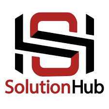
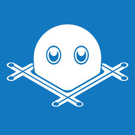

## Hi there 👋

 

>*This is Asad Ali. An innovative Web developer. I am passionate all the way with web development and cloud computing technologies Backend development & deployment. I have Excellent skills for building fully functional responsive Websites on Business Requirements using advance React and other latest web technologies to produce the best results Required. I'm a quick learner with a perfect analytical mindset and problem solving skills and always working on my programming strengths and finding more good strategies. Challenges are always accepted. I am highly enthusiastic and always ready to learn the skills with contemporary needs of IT industries*

### I have... 

* 🥉 3.5+ years of overall Experience in MERN Stack Web Development.

* 🏆 Develop web and mobile app applications and products according to client
briefs and modify designs to meet changes in client specifications.

* 👨‍💻 12 months experince in [Freelance and Remote Work Bootcamp 2020](https://panacloud.github.io/bootcamp-2020/?fbclid=IwAR12wYtzgr_YgBK3i92HJbvopK-f1BdJj_N87Rl2A2CfnoOUcMNoRexV_Gg). An internship and Career developing  
opportunity in which we studded and applied Front-end Technologies.

### Careeer 📕

✔️ Former, Junior MERN Stack Web Developer at <a href="" target="blank">SolutionHub</a>

✔️ Currently,  I am working in a software company known as <a href="" target="blank">HashPotato</a>

### My core skills included,

<h2 align="center">Front-End</h2>

&nbsp;&nbsp;&nbsp;&nbsp;
&nbsp;&nbsp;&nbsp;&nbsp;
&nbsp;&nbsp;&nbsp;&nbsp;
&nbsp;&nbsp;&nbsp;&nbsp;
&nbsp;&nbsp;&nbsp;&nbsp;
&nbsp;&nbsp;&nbsp;&nbsp;

**Front-End:** &emsp;&emsp;&emsp; &ensp; HTML, &ensp; JavaScript/ES6, &ensp; TypeScript, &ensp; React JS, &ensp; React Native &ensp; GraphQL, &ensp; Laravel.    
**Web Design:** &emsp;&emsp;&emsp;CSS, &ensp; SCSS, &ensp; Material UI, &ensp; Bootstrap, &ensp; WordPress, &ensp; Micromedia DreamWeaver.    
**Back-End:** &emsp; &emsp; &emsp; &ensp;Node JS, &ensp; Express JS, &ensp; MongoDB.  
**Graphic Design:** &emsp;&ensp;Adobe Photoshop, &ensp; Macromedia Flash 8.  
**Cloud Computing:** &nbsp;Linux(Ubuntu), &ensp; Docker, &ensp; Kubernetes.  
**Other Services:** &emsp; &ensp;Microsoft Office, &ensp; &ensp; Microsoft Visual Basic.
